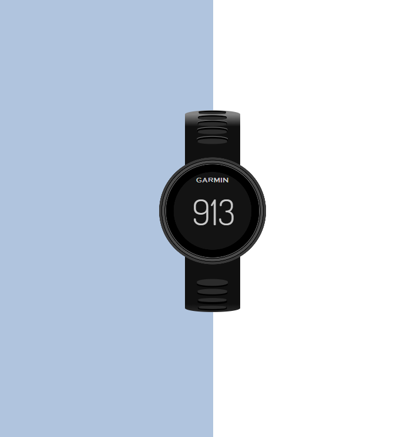

# Single Div 

Exploring the boundaries of CSS and setting myself a constraint to only use a single div for each design. 

Inspiration from Lynn Fisher @ https://a.singlediv.com/. 

Useful resources: 

- https://lynnandtonic.com/thoughts/entries/talk-illustration-with-css/
- https://css-tricks.com/newsletter/199-modern-css-solutions-and-the-single-div-project/ 
- https://hacks.mozilla.org/2014/09/single-div-drawings-with-css/
- https://css-tricks.com/animating-single-div-art/
- https://dev.to/elliehtml/realistic-css-art-hacks-27pk
